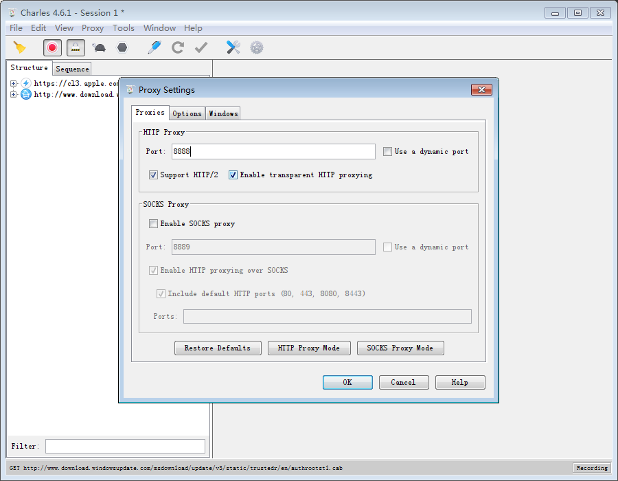
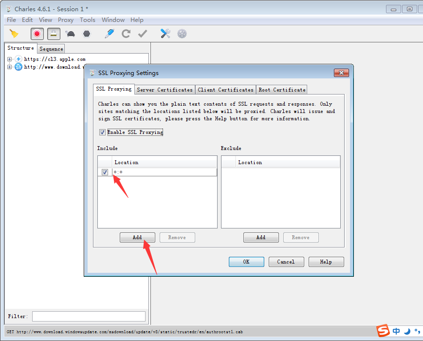
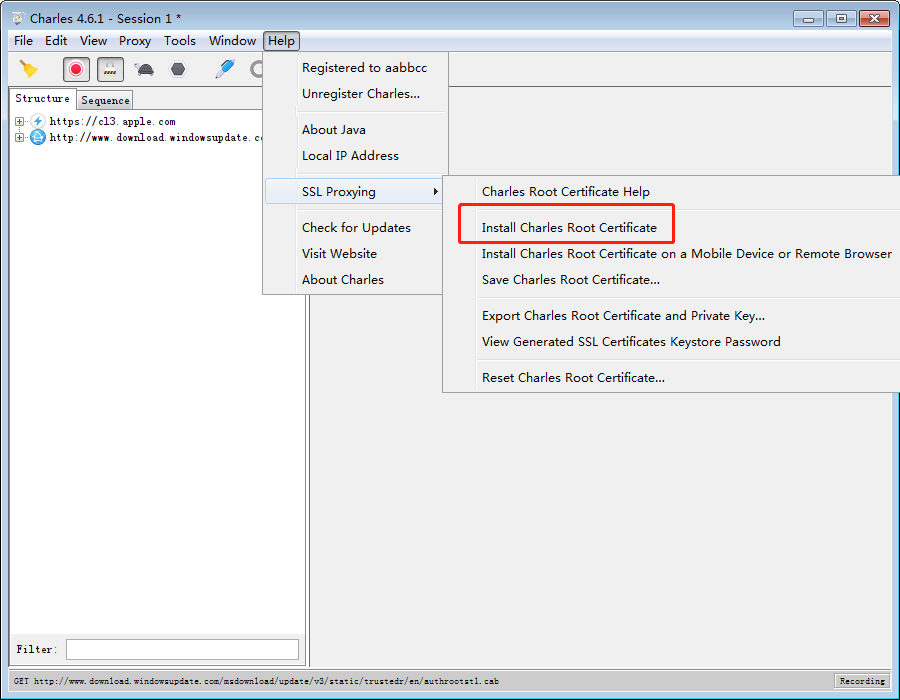
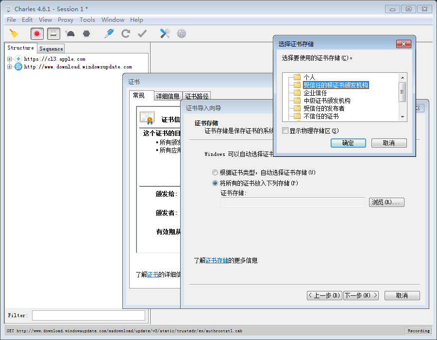
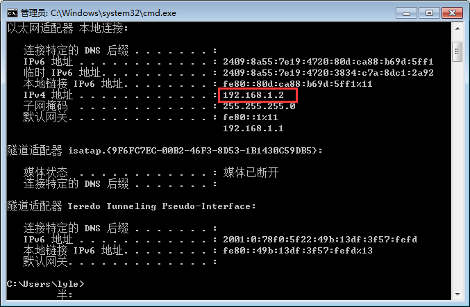
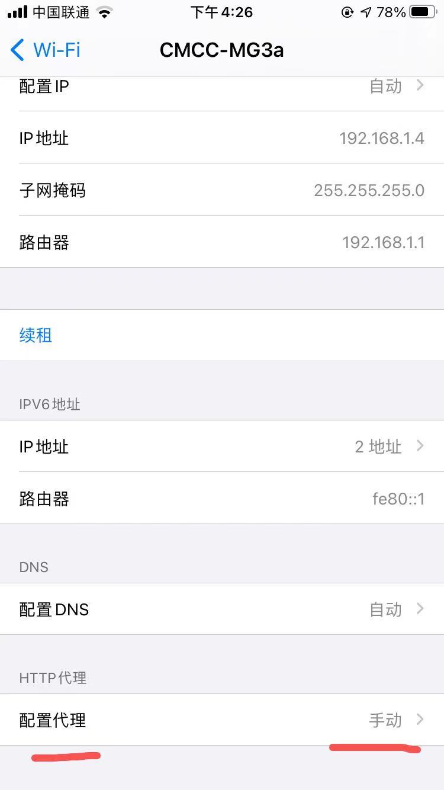
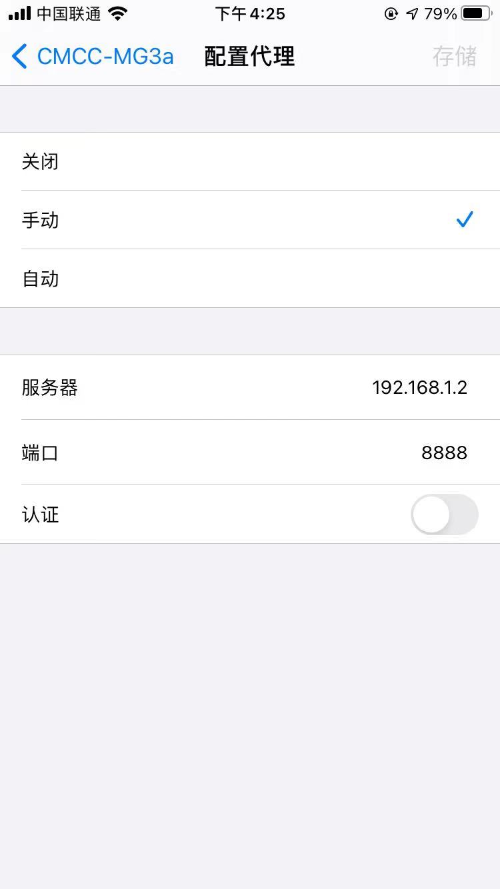
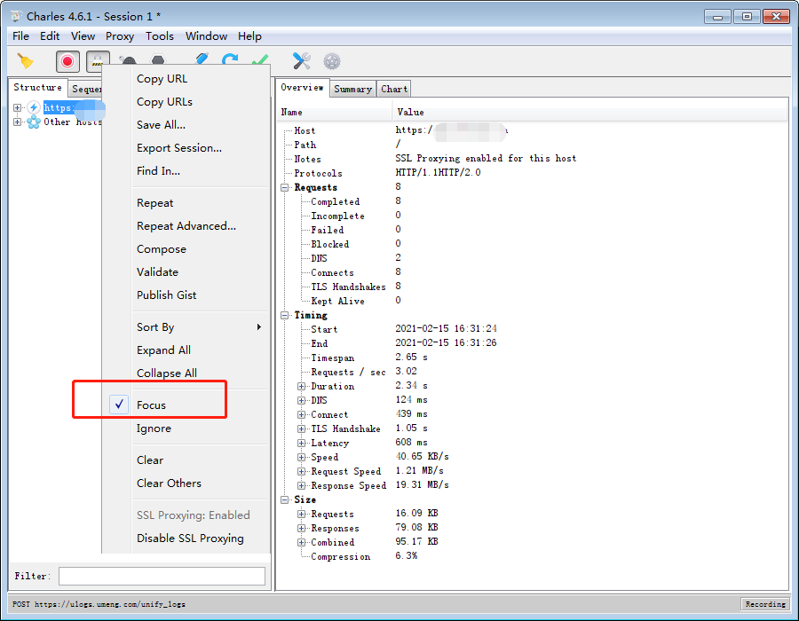

# 背景
最近做一个 APP 后端重构的项目，由于项目没有详细文档，不清楚具体有哪些请求，请求的数据格式如何，只能自己用抓包工具去抓，网上配置教程一大堆，但其中还是踩了一些坑，绕绕转转，也花了半个小时才彻底解决，花点时间记录下，方便下次配置的时候，快速上手。
# 下载 Charles
https://www.charlesproxy.com/download/
安装没什么的，就是下一步下一步搞定。

# PC 端配置
**Proxy - Proxy Setting**

<!-- more -->

**Proxy - SSL Proxy Setting**
添加一个配置项表示代理所有 ip 所有端口的 https 请求

**安装证书**

**查看 PC 端局域网内 ip 地址**
win + r，输入 cmd，输入 ipconfig

# 手机端配置
首先要确保手机和 PC 电脑在同一个局域网内，我手机和电脑连的是同一个路由器，自然在同一个局域网内，进入 wifi 设置，填写代理 ip 和 端口，**注意要关闭手机当前运行的所有代理软件，机场什么的。**

**手机端下载 PC 端证书，并安装**
手机浏览器访问 chls.pro 就会提示下载、安装，大功告成。

**focus 关心的请求**
选中需要代理的 api，右击 focus 就可以了
