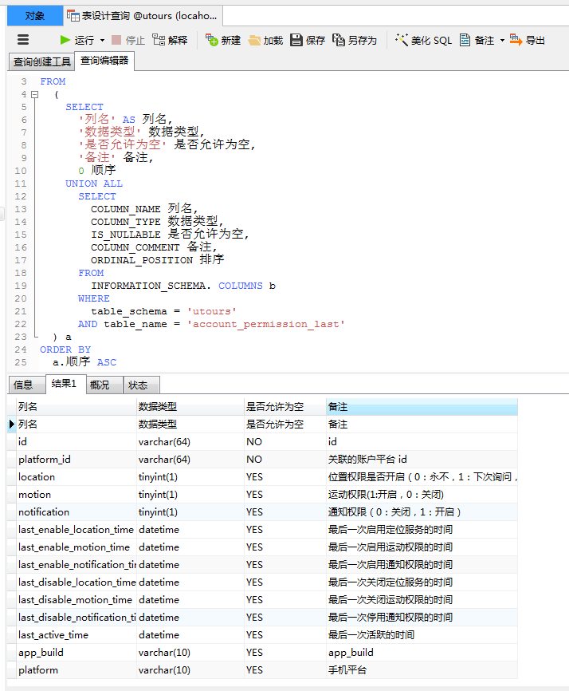

# 1 背景
最近接了个 APP 重构的项目，后端是用 node.js 写的，数据存放在 mongodb，重构第一步是梳理清楚数据库设计，用 Navicat 设计好表后，要编写 markdown 格式的数据库设计文档，为了省时间，研究了一下表设计导出 markdown 表格，大大提高了效率。

# 2 编写 sql 查询表结构

``` sql
SELECT
	a.列名,a.`数据类型`,a.`是否允许为空`,a.`备注`
FROM
	(
		SELECT
			'列名' AS 列名,
			'数据类型' 数据类型,
			'是否允许为空' 是否允许为空,
			'备注' 备注,
			0 顺序
		UNION ALL
			SELECT
				COLUMN_NAME 列名,
				COLUMN_TYPE 数据类型,
				IS_NULLABLE 是否允许为空,
				COLUMN_COMMENT 备注,
				ORDINAL_POSITION 排序
			FROM
				INFORMATION_SCHEMA. COLUMNS b
			WHERE
				table_schema = 'utours'
			AND table_name = 'account_permission_last'
	) a
ORDER BY
	a.顺序 ASC
```

<!-- more -->

代码执行后：


# 3 利用在线转换工具进行格式转换

ctrl + a 选中查询结果集，复制到一个在线转换 markdown 语法的网站 [tableconvert.com](https://tableconvert.com/) ，如下图：

就转换成 markdown 语法的表格了：
