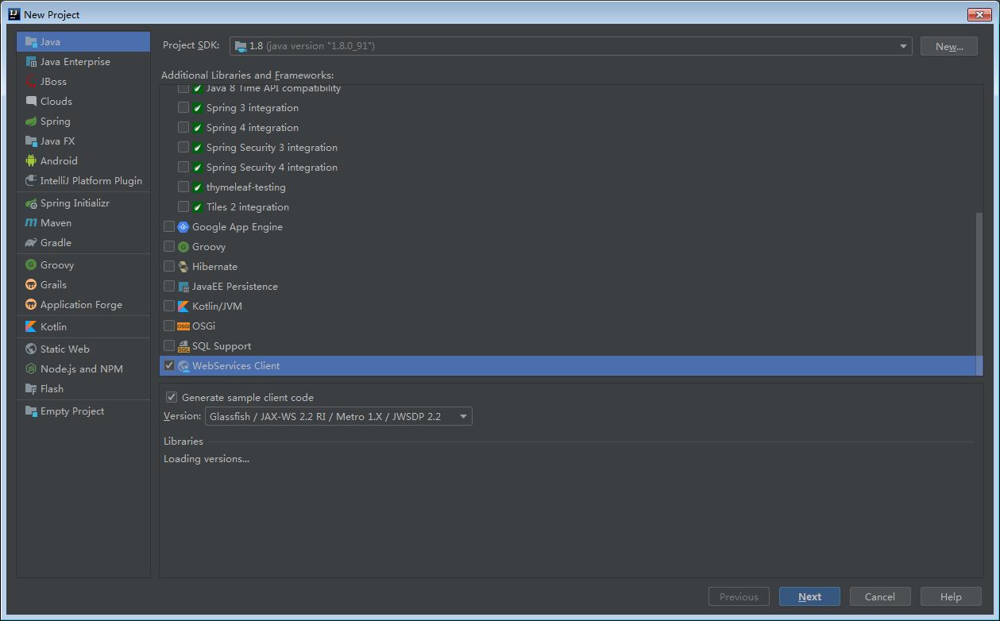
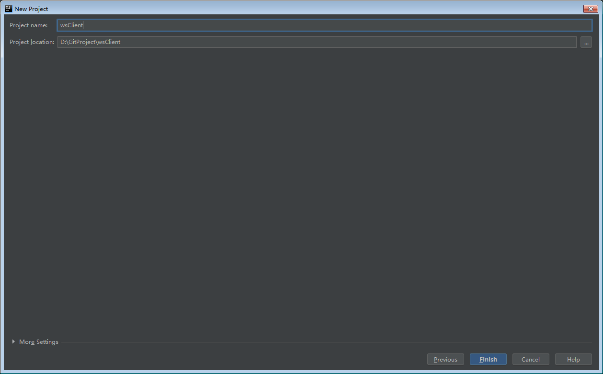
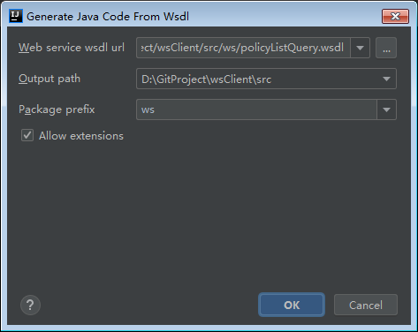
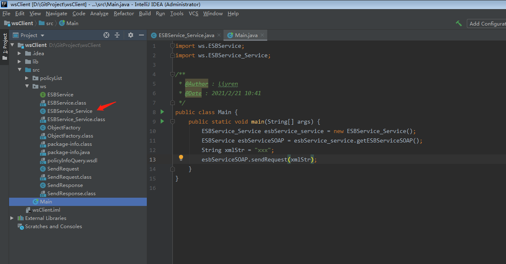

# 背景

最近接手的 App 重构项目，进入到第三方平台接口对接模块，看到只有一个接口文档，里面没有接口地址，没有协议说明，只有一些字段说明，一眼看去有点懵，不知如何下手。

于是翻看原 node.js 写的代码，找出了接口地址，发现是 wsdl 后缀，然后立马复制 url 用浏览器请求一下，发现本地打不开，原来是做了 ip 白名单，只允许服务器的 ip 请求，这就有点尴尬了，只好用 curl 命令在服务器上执行，发现返回了一段看不懂的 xml，经过谷歌搜索才知道这是传说中的 webService 接口。

还是第一次碰到 webService 接口对接，只能依赖搜索引擎来上手了，于是我就在 wsdl、soap、envelope、UUDI 等专业名词上转来转去了，半天过去都没明白正确的开发姿势是什么。

后来发现有个soapUi 的玩意能分析 wsdl 文件，提取服务接口地址参数等信息，再后面发现原来可以用 IDEA 根据 wsdl 地址生成 soapClient 代码，利用生成的代码即可完成服务远程调用。

知道了正确开发姿势，就开始动手了，然而事情并非那么简单，还是遇到了一些问题，下面记录一下。

# nginx 配置正向代理解决本地调试问题

由于用 IDEA 生成 soapClient 代码，需要提供 wsdl 文件的 url 地址或者本地 wsdl 文件，而由于对方白名单现在，我本地无法请求对方服务器，于是想起了在服务器架设 nginx 正向代理实现本地调试。

## nginx 增加 server 配置

 找到服务器的 nginx 配置文件目录，新建一个 conf 文件，填入配置，意思是将收到的请求全部转发，由于原项目用的是域名 + https，所以这里增加个配置不会干扰原来的线上环境。

```shell
server {
        resolver 114.114.114.114;
        listen 80;
        location / {
                proxy_pass http://222.xxx.xxx.116:7x00$request_uri;
        }
}
```

然后原来的 wsdl 地址： http://222.xxx.xxx.116:7x00/service/xxx/query?wsdl 修改服务器的 ip 地址就可以访问了，也就是：http://47.230.xxx.xxx/service/xxx/query?wsdl ，浏览器访问成功。

本以为 IDEA 填写这个 wsdl 地址就可以，没想到，IDEA 解析 wsdl 后，会访问里面 xsd 的 schemaLocation 地址进行解析，这就尴尬了，这个地址无法代理啊。

然而，还是有招，我把 wsdl 文件下载下来，把 xsd 的 schemaLocation 地址改掉服务器 ip 地址就可以了。

# IDEA 生成 soapClient 代码

jdk 1.8 生成过程有个坑，会出现乱码，需要往 jdk/jre/lib 目录下新建一个  jaxp.properties 文件，写入 

```properties
javax.xml.accessExternalSchema = all
```

接着就可以顺利生成代码了，如下图：









写个 main 方法调用生成的代码即可。