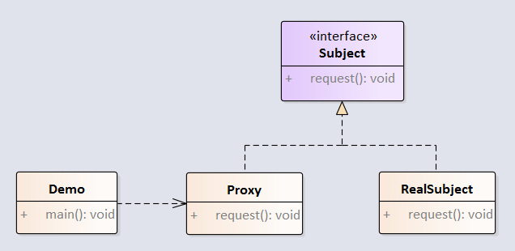

代理模式给某一个对象提供一个代 理，并由代理对象控制对原对象的引用。代理模式和装饰器模式、适配器模式很像，主要区别是装饰器模式为了增强已有对象的功能，而代理模式是为了加以控制。适配器模式主要改变所考虑对象的接口，而代理模式不能改变所代理类的接口。

例子：



<!-- more -->

## 1.创建Subject接口

```java
package com.notejava.proxy;

/**
 * @author lyle 2018/6/25 9:57.
 */
public interface Subject {
    void request();
}
```

## 2.创建RealSubject，实际工作对象

```java
package com.notejava.proxy;

/**
 * @author lyle 2018/6/25 9:58.
 */
public class RealSubject implements Subject {
    @Override
    public void request() {
        System.out.println("Real request");
    }
}
```

## 3.创建Proxy代理类

```java
package com.notejava.proxy;

/**
 * @author lyle 2018/6/25 9:58.
 */
public class Proxy implements Subject {
    private RealSubject realSubject;

    public Proxy() {
        realSubject = new RealSubject();
    }

    @Override
    public void request() {
        System.out.println("Proxy request");
        //before request;
        realSubject.request();
        //after request;
    }
}
```

## 4.创建Demo演示类

```java
package com.notejava.proxy;

/**
 * @author lyle 2018/6/25 9:57.
 */
public class Demo {
    public static void main(String\[\] args) {
        Proxy proxy = new Proxy();
        proxy.request();
    }
}
```