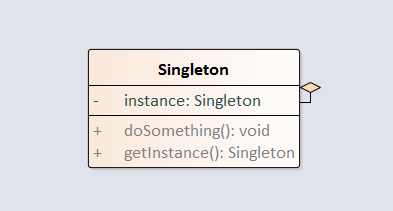

单例模式：确保某一个类只有一个实例，并提供全局访问该实例的方法。

uml图如下：



<!-- more -->

## 1.饿汉式

```java
package com.notejava.singleton.hungry;

/**
 * 饿汉式
 * instance 在类加载时就完成了初始化，所以类加载慢，对象获取速度快。
 *
 * @author lyle 2018/6/11 9:37.
 */
public class Singleton {
    private static Singleton instance = new Singleton();

    private Singleton() {}

    public static Singleton getInstance() {
        return instance;
    }
}
```

##  2.懒汉式  

```java
package com.notejava.singleton.lazy;

/**
 * 懒汉式
 * instance 在第一次被用户使用的时候才初始化，实现了懒加载，但线程不安全。
 * @author lyle 2018/6/11 9:45.
 */
public class Singleton {
    private static Singleton instance;

    private Singleton() {}

    public static Singleton getInstance() {
        if (instance == null) {
            instance = new Singleton();
        }
        return instance;
    }
}
```

## 3.线程安全的懒汉式

```java
package com.notejava.singleton.secure;

/**
 * 线程安全的懒汉式
 * 这种写法虽然线程安全，但每次调用都进行同步，效率低。
 * @author lyle 2018/6/11 9:50.
 */
public class Singleton {
    private static Singleton instance;

    private Singleton() {}

    public static synchronized Singleton getInstance() {
        if (instance == null) {
            instance = new Singleton();
        }
        return instance;
    }
}
```

## 4.双重检测懒汉式（DCL）  

```java
package com.notejava.singleton.dcl;

/**
 * 双重检测懒汉式（DCL）
 * DCL 模式虽然在一定程度解决了线程安全和资源的消耗问题，但某些情况下也会有DCL失效问题。
 * @author lyle 2018/6/11 9:58.
 */
public class Singleton {
    private volatile static Singleton instance;

    private Singleton() {}

    public static Singleton getInstance() {
        if (instance == null) {
            synchronized (Singleton.class) {
                if (instance == null) {
                    instance = new Singleton();
                }
            }
        }
        return instance;
    }
}
```

## 5.内部静态类式  

```java
package com.notejava.singleton.holder;

/**
 * 静态内部类单例模式
 * 类加载的时候不会初始化 instance，只有第一次调用 getInstance()，才加载内部类 SingletonHolder，并初始化 instance，既线程安全又保证唯一。
 * @author lyle 2018/6/11 10:07.
 */
public class Singleton {
    private Singleton() {}

    public static Singleton getInstance() {
        return SingletonHolder.instance;
    }

    private static class SingletonHolder {
        private static final Singleton instance = new Singleton();
    }
}
```

## 6.容器式  

```java
package com.notejava.singleton.manager;

import java.util.HashMap;
import java.util.Map;

/**
 * 容器式
 * 单例容器，将多种单例装进一个静态 map 里面，统一管理。
 * @author lyle 2018/6/11 10:19.
 */
public class SingleManager {
    private static Map instanceMap = new HashMap();

    private SingleManager() {}

    public static void register(String key, Object instance) {
        if (!instanceMap.containsKey(key)) {
            instanceMap.put(key, instance);
        }
    }

    public static Object get(String key) {
        return instanceMap.get(key);
    }
}
```