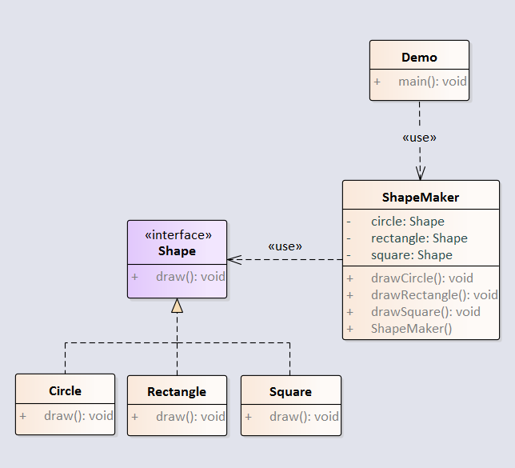

外观模式隐藏系统的复杂性，并向客户端提供了一个客户端可以访问系统的接口。这种模式涉及到一个单一的类，该类提供了客户端请求的简化方法和对现有系统类方法的委托调用。

例子：通过ShapeMaker简化Shape的创建。



<!-- more -->

## 1创建Shape类  

```java
package com.notejava.facade;

/**
 * @author lyle 2018/6/22 16:33.
 */
public interface Shape {
    void draw();
}
```

## 2.创建Circle类  

```java
package com.notejava.facade;

/**
 * @author lyle 2018/6/22 16:33.
 */
public class Circle implements Shape {
    @Override
    public void draw() {

    }
}
```

## 3.创建Rectangle类

```java
package com.notejava.facade;

/**
 * @author lyle 2018/6/22 16:34.
 */
public class Rectangle implements Shape {
    @Override
    public void draw() {

    }
}
```

## 4.创建Square类

```java
package com.notejava.facade;

/**
 * @author lyle 2018/6/22 16:34.
 */
public class Square implements Shape {
    @Override
    public void draw() {

    }
}
```

## 5.创建ShapeMaker类

```java
package com.notejava.facade;

/**
 * @author lyle 2018/6/22 16:34.
 */
public class ShapeMaker {
    protected Shape circle;
    protected Shape rectangle;
    protected Shape square;

    public ShapeMaker() {
        this.circle = new Circle();
        this.rectangle = new Rectangle();
        this.square = new Square();
    }

    public void drawCircle() {

    }

    public void drawRectangle() {

    }

    public void drawSquare() {

    }
}
```

## 6.创建Demo类

```java
package com.notejava.facade;

/**
 * @author lyle 2018/6/22 16:38.
 */
public class Demo {
    public static void main(String\[\] args) {
        ShapeMaker shapeMaker = new ShapeMaker();
        shapeMaker.drawCircle();
        shapeMaker.drawRectangle();
        shapeMaker.drawSquare();
    }
}
```