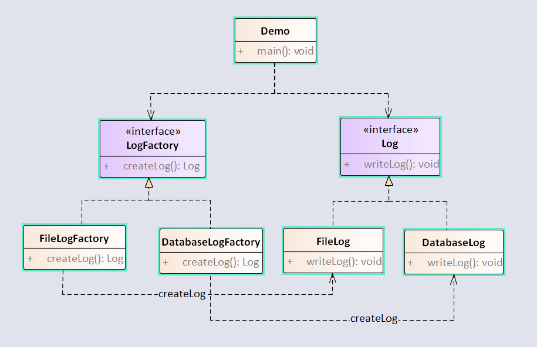

工厂方法模式将工厂也进行抽象化，产品类的实例化又对应的子工厂实例化。  

例子如下：  



<!-- more -->

代码实现如下：  

## 1.定义Log接口  

```java
package com.notejava.factory.simple;

/**
 * @author lyle 2018/6/19 11:03.
 */
public interface Log {
    void write();
}
```

## 2.定义FileLog类

```java
package com.notejava.factory.simple;

/**
 * @author lyle 2018/6/19 10:22.
 */
public class FileLog implements Log {
    public void write() {
        System.out.println("write to file");
    }
}
```

## 3.定义DatabaseLog类

```java
package com.notejava.factory.simple;

/**
 * @author lyle 2018/6/19 10:23.
 */
public class DatabaseLog implements Log {
    public void write() {
        System.out.println("write to database");
    }
}
```

## 4.定义LogFactory类

```java
package com.notejava.factory.method;

/**
 * @author lyle 2018/6/19 10:20.
 */
public interface LogFactory {
    Log createLog();
}
```

## 5.定义FileLogFactory类  

```java
package com.notejava.factory.method;

/**
 * @author lyle 2018/6/19 10:21.
 */
public class FileLogFactory implements LogFactory {
    public Log createLog() {
        return new FileLog();
    }
}
```

## 6.定义DatabaseLogFactory类

```java
package com.notejava.factory.method;

/**
 * @author lyle 2018/6/19 10:21.
 */
public class DatabaseLogFactory implements LogFactory {
    public Log createLog() {
        return new DatabaseLog();
    }
}
```

## 7.定义Demo类  

```java
package com.notejava.factory.method;

/**
 * @author lyle 2018/6/19 10:18.
 */
public class Demo {
    public static void main(String\[\] args) {
        FileLogFactory fileLogFactory = new FileLogFactory();
        Log fileLog = fileLogFactory.createLog();
        fileLog.write();

        DatabaseLogFactory databaseLogFactory = new DatabaseLogFactory();
        Log databaseLog = databaseLogFactory.createLog();
        databaseLog.write();
    }
}
```