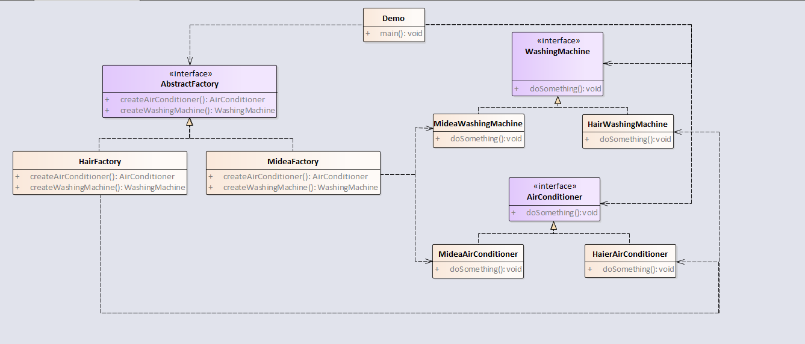

抽象工厂模式与工厂方法模式最大的区别在于，工厂方法模式针对的是一个产品等级结构，而抽象工厂模式则需要面对多个产品等级结构。

产品等级：如一个抽象类是空调，其子类有海尔空调，美的空调；如一个抽象类是洗衣机，其子类有海尔洗衣机，美的洗衣机。

产品族：产品族是指由同一个工厂生产的，位于不同产品等级结构中的一组产品。如海尔生产的冰箱和洗衣机。

例子如下：  



<!-- more -->

代码如下：

## 1.定义AbstractFactory

```java
package com.notejava.factory.abstraction;

/**
 * @author lyle 2018/6/19 15:45.
 */
public interface AbstractFactory {
    WashingMachine createWashingMachine();
    AirConditioner createAirConditioner();
}
```

## 2.定义HairFactory  

```java
package com.notejava.factory.abstraction;

/**
 * @author lyle 2018/6/19 15:45.
 */
public class HairFactory implements AbstractFactory {
    public WashingMachine createWashingMachine() {
        return new HairWashingMachine();
    }

    public AirConditioner createAirConditioner() {
        return new HairAirConditioner();
    }
}
```

## 3.定义MideaFactory  

```java
package com.notejava.factory.abstraction;

/**
 * @author lyle 2018/6/19 15:48.
 */
public class MideaFactory implements AbstractFactory {
    public WashingMachine createWashingMachine() {
        return new MideaWashingMachine();
    }

    public AirConditioner createAirConditioner() {
        return new MideaAirConditioner();
    }
}
```

## 4.定义空调接口AirConditioner

```java
package com.notejava.factory.abstraction;

/**
 * @author lyle 2018/6/19 15:47.
 */
public interface AirConditioner {
    void makeAir();
}
```

## 5.定义洗衣机接口

```java
package com.notejava.factory.abstraction;

/**
 * @author lyle 2018/6/19 15:46.
 */
public interface WashingMachine {
    void wash();
}
```

## 6.定义海尔空调  

```java
package com.notejava.factory.abstraction;

/**
 * @author lyle 2018/6/19 15:49.
 */
public class HairAirConditioner implements AirConditioner {
    public void makeAir() {
        System.out.println("HairAirConditioner");
    }
}
```

## 7.定义海尔洗衣机

```java
package com.notejava.factory.abstraction;

/**
 * @author lyle 2018/6/19 15:50.
 */
public class HairWashingMachine implements WashingMachine {
    public void wash() {
        System.out.println("HairWashingMachine");
    }
}
```

## 8.定义美的空调

```java
package com.notejava.factory.abstraction;

/**
 * @author lyle 2018/6/19 15:50.
 */
public class MideaAirConditioner implements AirConditioner {
    public void makeAir() {
        System.out.println("MideaAirConditioner");
    }
}
```

## 9.定义美的洗衣机

```java
package com.notejava.factory.abstraction;

/**
 * @author lyle 2018/6/19 15:51.
 */
public class MideaWashingMachine implements WashingMachine {
    public void wash() {
        System.out.println("MideaWashingMachine");
    }
}
```

## 10.定义Demo类

```java
package com.notejava.factory.abstraction;

/**
 * @author lyle 2018/6/19 15:45.
 */
public class Demo {
    public static void main(String\[\] args) {
        HairFactory hairFactory = new HairFactory();
        hairFactory.createAirConditioner().makeAir();
        hairFactory.createWashingMachine().wash();
        MideaFactory mideaFactory = new MideaFactory();
        mideaFactory.createAirConditioner().makeAir();
        mideaFactory.createWashingMachine().wash();
    }
}
```