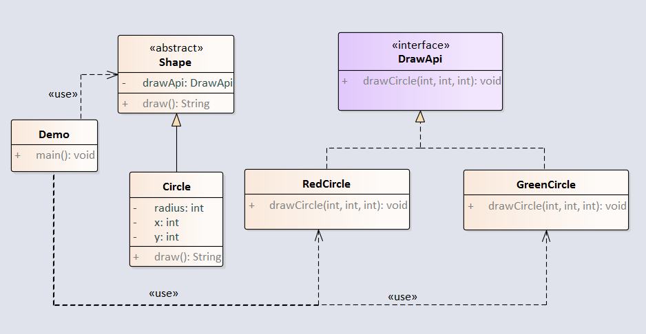

桥接是用于把抽象化与实现化解耦，使得二者可以独立变化。这种模式涉及到一个作为桥接的接口，使得实体类的功能独立于接口实现类。这两种类型的类可被结构化改变而互不影响。

例子：通过定义桥接接口DrawApi，把Shape的draw功能独立出来。



<!-- more -->

## 1.创建Shape抽象类

```java
package com.notejava.bridge;

/**
 * @author lyle 2018/6/22 14:30.
 */
public abstract class Shape {
    protected DrawApi drawApi;

    public Shape(DrawApi drawApi) {
        this.drawApi = drawApi;
    }

    public abstract void draw();
}
```

## 2.创建Circle类，集成Shape  

```java
package com.notejava.bridge;

/**
 * @author lyle 2018/6/22 14:32.
 */
public class Circle extends Shape {
    private int x, y, radius;

    public Circle(int x, int y, int radius, DrawApi drawApi) {
        super(drawApi);
        this.x = x;
        this.y = y;
        this.radius = radius;
    }

    @Override
    public void draw() {
        drawApi.drawCircle(radius, x, y);
    }
}
```

## 3.创建桥接接口DrawApi

```java
package com.notejava.bridge;

/**
 * @author lyle 2018/6/22 14:30.
 */
public interface DrawApi {
    void drawCircle(int radius, int x, int y);
}
```

## 4.创建实现类RedCircle

```java
package com.notejava.bridge;

/**
 * @author lyle 2018/6/22 14:36.
 */
public class RedCircle implements DrawApi {
    @Override
    public void drawCircle(int radius, int x, int y) {
        System.out.println("Drawing Circle\[ color: red, radius: " + radius + ", x: " + x + ", " + y + "\]");
    }
}
```

## 5.创建实现类GreenCircle

```java
package com.notejava.bridge;

/**
 * @author lyle 2018/6/22 14:38.
 */
public class GreenCircle implements DrawApi {
    @Override
    public void drawCircle(int radius, int x, int y) {
        System.out.println("Drawing Circle\[ color: green, radius: " + radius + ", x: " + x + ", "+ y + "\]");
    }
}
```

## 6.创建Demo类

```java
package com.notejava.bridge;

/**
 * @author lyle 2018/6/22 14:20.
 */
public class Demo {
    public static void main(String\[\] args) {
        Shape redCircle = new Circle(100,100, 10, new RedCircle());
        Shape greenCircle = new Circle(100,100, 10, new GreenCircle());
        redCircle.draw();
        greenCircle.draw();
    }
}
```