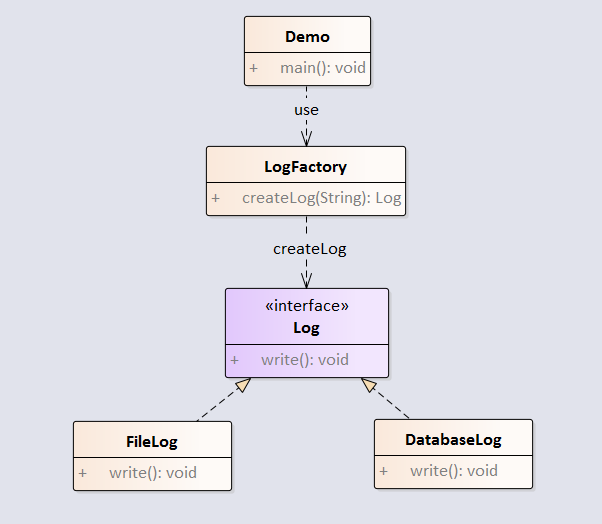

简单工厂模式：专门定义一个类来负责创建其他类的实例，被创建的实例通常都具有共同的父类。

例子如下：



<!-- more -->

代码实现如下：  

## 1.定义Log接口  

```java
package com.notejava.factory.simple;

/**
 * @author lyle 2018/6/19 11:03.
 */
public interface Log {
    void write();
}
```

## 2.定义FileLog类

```java
package com.notejava.factory.simple;

/**
 * @author lyle 2018/6/19 10:22.
 */
public class FileLog implements Log {
    public void write() {
        System.out.println("write to file");
    }
}
```

## 3.定义DatabaseLog类

```java
package com.notejava.factory.simple;

/**
 * @author lyle 2018/6/19 10:23.
 */
public class DatabaseLog implements Log {
    public void write() {
        System.out.println("write to database");
    }
}
```

## 4.定义LogFactory类  

```java
package com.notejava.factory.simple;

/**
 * @author lyle 2018/6/19 11:05.
 */
public class LogFactory {
    public Log createLog(String logType) {
        if ("fileLog".equals(logType)) {
            return new FileLog();
        }
        if ("databaseLog".equals(logType)) {
            return new DatabaseLog();
        }
        return null;
    }
}
```

## 5.定义Demo类  

```java
package com.notejava.factory.simple;

/**
 * @author lyle 2018/6/19 11:07.
 */
public class Demo {
    public static void main(String\[\] args) {
        LogFactory logFactory = new LogFactory();
        Log fileLog = logFactory.createLog("fileLog");
        if (fileLog != null)
            fileLog.write();
        Log databaseLog = logFactory.createLog("databaseLog");
        if (databaseLog != null)
            databaseLog.write();
    }
}
```