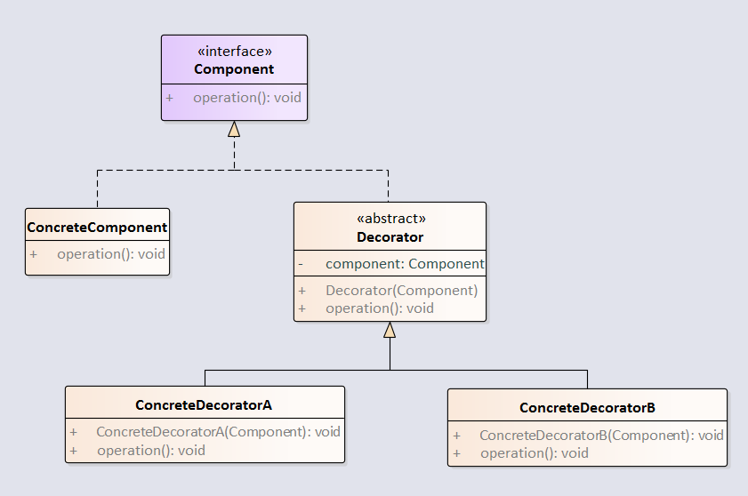

装饰器模式可以用于增强一个现有的对象，同时又不改变其结构。

uml图如下：



<!-- more -->

代码如下：

**抽象构件**  

```java
package com.notejava.decorator;

/**
 * @author lyle 2018/6/22 15:35.
 */
public interface Component {
    void operation();
}
```

**具体构件**  

```java
package com.notejava.decorator;

/**
 * @author lyle 2018/6/22 15:35.
 */
public class ConcreteComponent implements Component {
    @Override
    public void operation() {

    }
}
```

**装饰器**  

```java
package com.notejava.decorator;

/**
 * @author lyle 2018/6/22 15:36.
 */
public abstract class Decorator implements Component {
    protected Component component;

    public Decorator(Component component) {
        this.component = component;
    }

    @Override
    public abstract void operation();
}
```

**具体装饰器**  

```java
package com.notejava.decorator;

/**
 * @author lyle 2018/6/22 15:42.
 */
public class ConcreteDecoratorA extends Decorator {
    public ConcreteDecoratorA(Component component) {
        super(component);
    }

    @Override
    public void operation() {
        //doSomething
        component.operation();
        ////doSomething
    }
}
```

**具体装饰器**

```java
package com.notejava.decorator;

/**
 * @author lyle 2018/6/22 15:43.
 */
public class ConcreteDecoratorB extends Decorator {
    public ConcreteDecoratorB(Component component) {
        super(component);
    }

    @Override
    public void operation() {
        //doSomething
        component.operation();
        //doSomething
    }
}
```