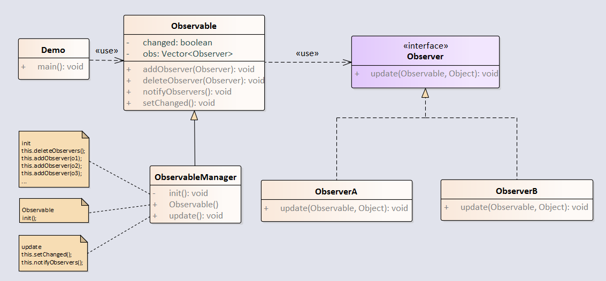

观察者模式用于一对多的对象关系中，当一个对象被修改时，会自动通知它的依赖对象。java中通过Observable类和Observer接口实现了观察者模式。

例子：



<!-- more -->

**Observer（观察者）**

```java
package java.util;
public interface Observer {
    void update(Observable o, Object arg);
}
```

**Observable（被观察者）**

```java
package java.util;
public class Observable {
    private boolean changed = false;
    private Vector obs;

    /** Construct an Observable with zero Observers. */

    public Observable() {
        obs = new Vector<>();
    }
    
    public synchronized void addObserver(Observer o) {
        if (o == null)
            throw new NullPointerException();
        if (!obs.contains(o)) {
            obs.addElement(o);
        }
    }
    
    public synchronized void deleteObserver(Observer o) {
        obs.removeElement(o);
    }
    
    public void notifyObservers() {
        notifyObservers(null);
    }
    
    public void notifyObservers(Object arg) {
        Object\[\] arrLocal;
    
        synchronized (this) {
            if (!changed)
                return;
            arrLocal = obs.toArray();
            clearChanged();
        }
    
        for (int i = arrLocal.length-1; i>=0; i--)
            ((Observer)arrLocal\[i\]).update(this, arg);
    }
    
    protected synchronized void setChanged() {
        changed = true;
    }
}
```

**创建ObserverA，实现Observer接口**

```java
package com.notejava.observer;

import java.util.Observable;
import java.util.Observer;

/**
 * @author lyle 2018/6/25 11:16.
 */
public class ObserverA implements Observer {
    @Override
    public void update(Observable o, Object arg) {
        System.out.println("ObserverA do update");
    }
}
```

**创建ObserverB，实现Observer接口**

```java
package com.notejava.observer;

import java.util.Observable;
import java.util.Observer;

/**
 * @author lyle 2018/6/25 11:16.
 */
public class ObserverB implements Observer {
    @Override
    public void update(Observable o, Object arg) {
        System.out.println("ObserverB do update");
    }
}
```

**创建ObserverManager，继承Observable**

```java
package com.notejava.observer;

import java.util.Observable;

/**
 * @author lyle 2018/6/25 11:28.
 */
public class ObserverManager extends Observable {
    public ObserverManager() {
        init();
    }

    public void init() {
        this.deleteObservers();
        this.addObserver(new ObserverA());
        this.addObserver(new ObserverB());
    }

    public void update() {
        this.setChanged();
        this.notifyObservers();
    }
}
```

**创建Demo演示类**

```java
package com.notejava.observer;

/**
 * @author lyle 2018/6/25 10:33.
 */
public class Demo {
    public static void main(String\[\] args) {
        new ObserverManager().update();
    }
}
```