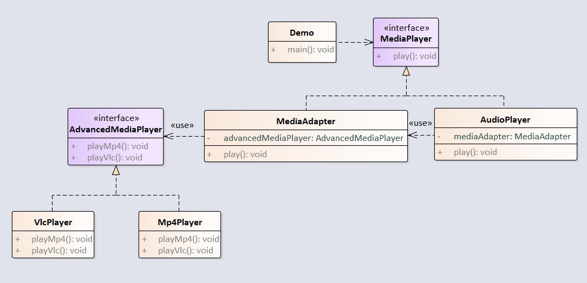

适配器模式将一个类的接口转换成客户希望的另外一个接口。适配器模式使得原本由于接口不兼容而不能一起工作的那些类可以一起工作。

例子：音频播放器设备只能播放 mp3 文件，通过适配器来实现播放 vlc 和 mp4 文件。



<!-- more -->

## 1创建MediaPlayer，代表普通的媒体播放器。

```java
package com.notejava.adapter;

/**
 * @author lyle 2018/6/21 14:33.
 */
public interface MediaPlayer {
    void play(String audioType, String fileName);
}
```

## 2.创建AudioPlayer，代表音乐媒体播放器，只能播放MP3。

```java
package com.notejava.adapter;

/**
 * @author lyle 2018/6/21 14:35.
 */
public class AudioPlayer implements MediaPlayer {
    private MediaAdapter mediaAdapter = null;

    @Override
    public void play(String audioType, String fileName) {
        if ("mp3".equals(audioType)) {
            //内置播放mp3功能
        } else if ("vlc".equals(audioType) || "mp4".equals(audioType)) {
            mediaAdapter = new MediaAdapter(audioType);
            mediaAdapter.play(audioType, fileName);
        } else {
            System.out.println("not match audioType");
        }
    }
}
```

## 3.创建MediaAdapter，代表媒体适配器，通过它，可以使普通播放器拥有高级播放器的播放功能。

```java
package com.notejava.adapter;

/**
 * @author lyle 2018/6/21 14:34.
 */
public class MediaAdapter implements MediaPlayer {
    private AdvancedMediaPlayer advancedMusicPlayer;

    public MediaAdapter(String audioType) {
        if ("vlc".equals(audioType)) {
            advancedMusicPlayer = new VlcPlayer();
        } else if ("mp4".equals(audioType)) {
            advancedMusicPlayer = new Mp4Player();
        }
    }

    @Override
    public void play(String audioType, String fileName) {
        if ("vlc".equals(audioType)) {
            advancedMusicPlayer.playVlc(fileName);
        } else if ("mp4".equals(audioType)) {
            advancedMusicPlayer.playMp4(fileName);
        }
    }
}
```

## 4.创建AdvancedMediaPlayer，代表高级媒体播放器。

```java
package com.notejava.adapter;

/**
 * @author lyle 2018/6/21 14:35.
 */
public interface AdvancedMediaPlayer {
    void playVlc(String fileName);
    void playMp4(String fileName);
}
```

## 5.创建VlcPlayer，代表vlc播放器。

```java
package com.notejava.adapter;

/**
 * @author lyle 2018/6/21 14:36.
 */
public class VlcPlayer implements AdvancedMediaPlayer {
    @Override
    public void playVlc(String fileName) {
        System.out.println("play vlc : " + fileName);
    }

    @Override
    public void playMp4(String fileName) {

    }
}
```

## 6.创建Mp4Player，代表MP4播放器。

```java
package com.notejava.adapter;

/**
 * @author lyle 2018/6/21 14:36.
 */
public class Mp4Player implements AdvancedMediaPlayer {
    @Override
    public void playVlc(String fileName) {

    }

    @Override
    public void playMp4(String fileName) {
        System.out.println("play MP4 : " + fileName);
    }
}
```

## 7.创建演示类Demo。

```java
package com.notejava.adapter;

/**
 * @author lyle 2018/6/21 14:38.
 */
public class Demo {
    public static void main(String\[\] args) {
        AudioPlayer audioPlayer = new AudioPlayer();
        audioPlayer.play("mp4", "my love");
    }
}
```